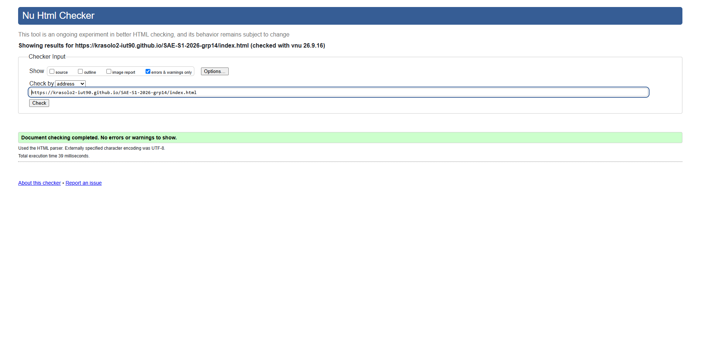
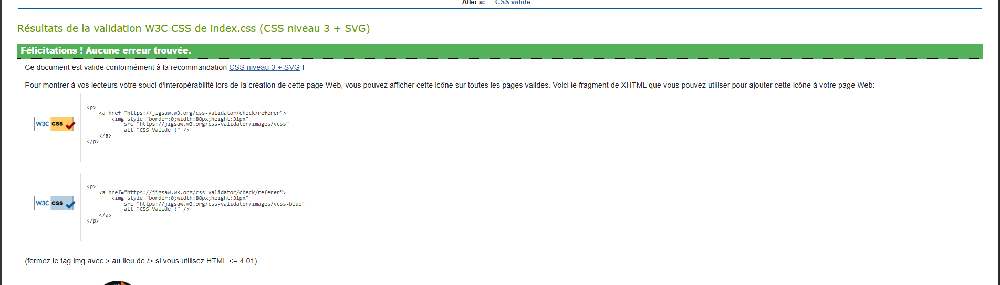
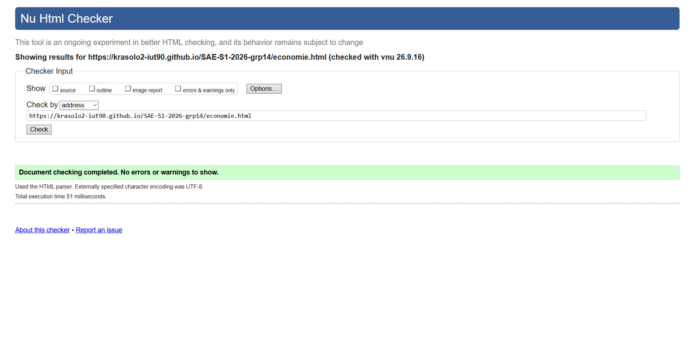
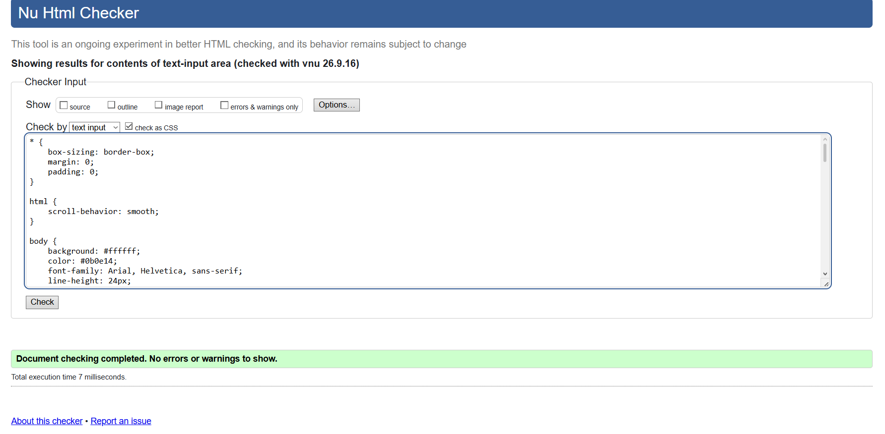
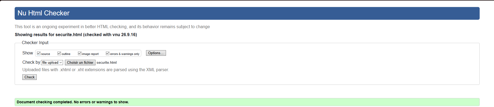
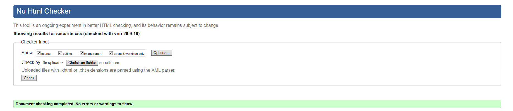

# SAE-S1-2026-grp14

## Sujet

OVHcloud\
[lien du site du projet](https://krasolo2-iut90.github.io/SAE-S1-2026-grp14/)

## Membres du groupe
  * [Miloud Djelloul (référent)](mailto:miloud.djelloul@edu.univ-fcomte.fr?subject=SAE_1_05_06)
  * [Maouf Amine](mailto:maouf.amine@edu.univ-fcomte.fr?subject=SAE_1_05_06)
  * [Ozturk Ozan](mailto:ozan.ozturk@edu.univ-fcomte.fr?subject=SAE_1_05_06)
  * [Rasolo Kenza](mailto:rasolo_dit_rasolonjatovo@edu.univ-fcomte.fr?subject=SAE_1_05_06)

## Présentation
Ce dépôt correspond à un site créé en HTML/CSS dans le cadre de la SAÉ 05-06 à l'IUT Nord Franche-Comté. Ce site présente des informations concernant l'entreprise OVHcloud et présentera l'entreprise, ses services, sa sécurité, ses infrastructures et aspects écologiques.

## Choix de conception
Pour la conception du site, nous nous sommes grandement inspirés du site officiel de [Google cloud](https://google.cloud.com), de [cloudflare](https://www.cloudflare.com/fr-fr/) et d'[aternos](https://aternos.org/:fr/).

## Développement Site Web et Validation des pages

### Page d'accueil

**Auteur: Amine**

Vérification W3C : [Détail ICI]([https://validator.w3.org/nu/?showsource=yes&showoutline=yes&showimagereport=yes&doc=https%3A%2F%2Fdemo-am90.github.io%2Fs1-demo%2Findex.html](https://validator.w3.org/nu/?level=warning&doc=https%3A%2F%2Fkrasolo2-iut90.github.io%2FSAE-S1-2026-grp14%2Findex.html#file))

 

### Présentation économique

**Auteur: Ozturk Ozan**

Vérification W3C : [Détail ICI](https://validator.w3.org/nu/?showsource=yes&showoutline=yes&showimagereport=yes&doc=https%3A%2F%2Fdemo-am90.github.io%2Fs1-demo%2Findex.html)

 

### Présentation des infrastructures et de l'aspect écologique

**Auteur: Rasolo Kenza**

Vérification W3C : [Détail ICI](https://validator.w3.org/nu/?doc=https%3A%2F%2Fkrasolo2-iut90.github.io%2FSAE-S1-2026-grp14%2FpageEcolo.html)

 

### Présentation de l'aspect de confiance et sécuritaire 

**Auteur: Miloud Djelloul**

Vérification W3C : [Détail ICI](https://validator.w3.org/nu/?showsource=yes&showoutline=yes&showimagereport=yes&doc=https%3A%2F%2Fdemo-am90.github.io%2Fs1-demo%2Findex.html)

 

## Répartition du travail
### Développement site

- Maouf Amine
  - "Template" de page (Navbar/Footer)
  - Page d’accueil
- Ozturk Ozan
  - Présentation économique
  - Création un bouton traduction anglais/français
- Rasolo Kenza
  - Page infrastructure et écologie
  - Création thème clair/sombre
- Miloud Djelloul
  - Intation d'une carte interactive
  - Page sécurité et confiance
  - Facultatif: agent ia

## Contributeurs

